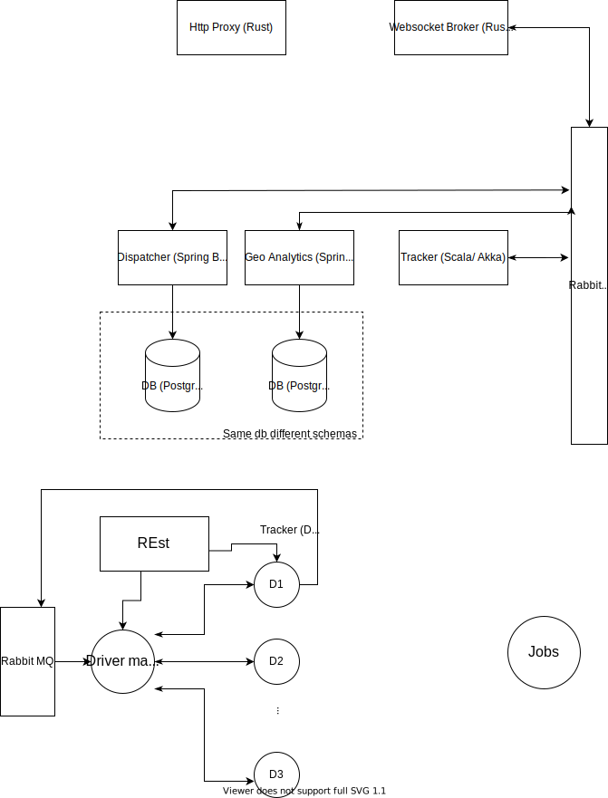

# Test Presentation

 Sample code

```scala
enum  Node[+T]:
  case Tree[T]
  case Leaf

sealed Trait {
  val foo
  def do[A](a: A): A
}

sealed Trait {
  val foo
  def do[A](a: A): A
}

sealed Trait {
  val foo
  def do[A](a: A): A
}

sealed Trait {
  val foo
  def do[A](a: A): A
}
```
---


<!--  -->

